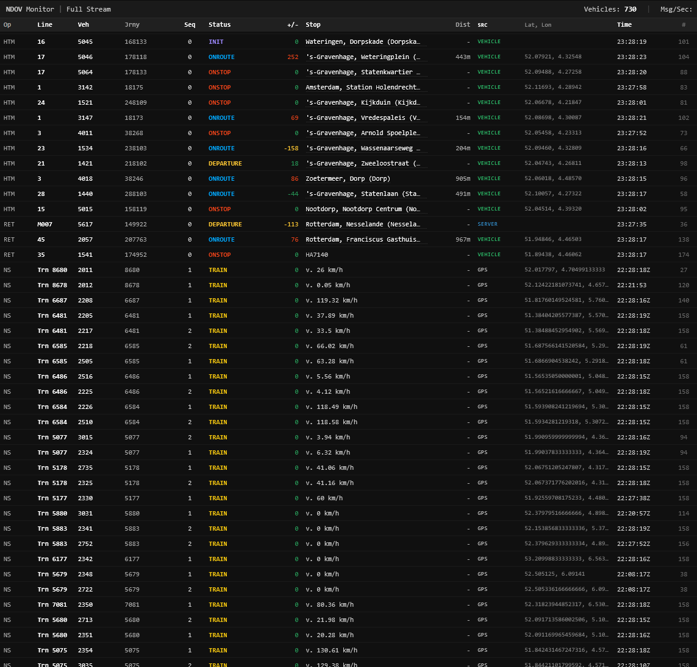

# NDOV Real-time Vehicle Monitor

A high-density, real-time dashboard for monitoring public transport vehicles across the Netherlands. 

This application connects directly to the **NDOV Loket** ZeroMQ streams, processes XML messages for Buses, Trams, Metros (KV6), and Trains (NS Interface 5), and visualizes them in a live data grid.

</img>

### WARNING: This is 90% AI slop.

## Features

* **Multi-Stream Support:** Simultaneously consumes data from:
    * **Urban Transport (KV6/KV17):** Bus, Tram, Metro (RET, HTM, Connexxion, etc.).
    * **National Rail (NS Interface 5):** Real-time GPS locations of NS trains.
* **Static Data Resolution:** Maps cryptic `UserStopCode` IDs (e.g., `HA1234`) to human-readable stop names (e.g., "Den Haag, Centraal") using the CHB database.
* **Geospatial Projection:** automatically converts Dutch Rijksdriehoek (RD New) coordinates to standard WGS84 Lat/Lon for mapping.
* **High-Density Grid:** specialized frontend designed to display hundreds of vehicle updates per second with minimal overhead.
* **Drill-down:** Click any row to inspect the raw JSON payload; hover over GPS coordinates for direct Google Maps links.

## Prerequisites

* **Node.js:** v20+
* **NDOV Static Data Files:** (Required for stop name resolution)

### 1. Download Static Data
To resolve stop codes to names, you need two XML files from the NDOV Loket (Centraal Halte Bestand). 

1.  **ExportCHB.xml** (The database of stops/names) → Save as `stops-db.xml`
2.  **PassengerStopAssignmentExportCHB.xml** (The link between codes and stops) → Save as `stops-lookup.xml`

*Note: These files are usually available via NDOV data subscriptions or open data portals.*

### 2. File Structure
Ensure your root directory looks like this:

```text
/ndov-monitor
├── node_modules/
├── index.js           # Main Entry point & ZMQ Logic
├── ns-handler.js      # NS Train Logic
├── index.html         # Frontend Dashboard
├── package.json
├── stops-db.xml       # (Large XML ~100MB+)
└── stops-lookup.xml   # (Assignment XML)

```

## Installation

```bash
# Clone the repository
git clone <your-repo-url>
cd ndov-monitor

# Install dependencies
npm install

```

## Usage

Start the server. On boot, it will take a few seconds to load and parse the static XML files into memory.

```bash
node index.js

```

Once you see `Monitor running at http://localhost:3000`, open your browser.

## Configuration

The ZeroMQ endpoints are configured in `index.js` under `ZMQ_SOURCES`.

```javascript
const ZMQ_SOURCES = {
    // KV6 (Bus/Tram/Metro)
    "tcp://pubsub.besteffort.ndovloket.nl:7658": ["/RIG/KV6posinfo", "/RIG/KV17cvlinfo"],
    
    // NS Trains (GPS)
    "tcp://pubsub.besteffort.ndovloket.nl:7664": ["/RIG/NStreinpositiesInterface5"]
};

```

## Architecture

1. **Ingest:** `zeromq.js` connects to the NDOV PubSub servers.
2. **Decode:** Messages are Gzip decompressed using Node's `zlib`.
3. **Parse:** `fast-xml-parser` converts XML payloads to JSON.
4. **Normalize:** * **KV6:** RD coordinates are projected to WGS84 using `proj4`. Stop names are looked up from the static map.
* **NS:** Data is normalized to match the KV6 schema (Speed mapped to 'Stop', Lat/Lon passed through).


5. **Broadcast:** Updates are pushed to the web client via `socket.io`.
6. **Render:** The browser updates a virtualized-style DOM table, using CSS animations to highlight changing data.

## Links
https://data.ndovloket.nl/haltes/


## License

[MIT](https://www.google.com/search?q=LICENSE)
:
